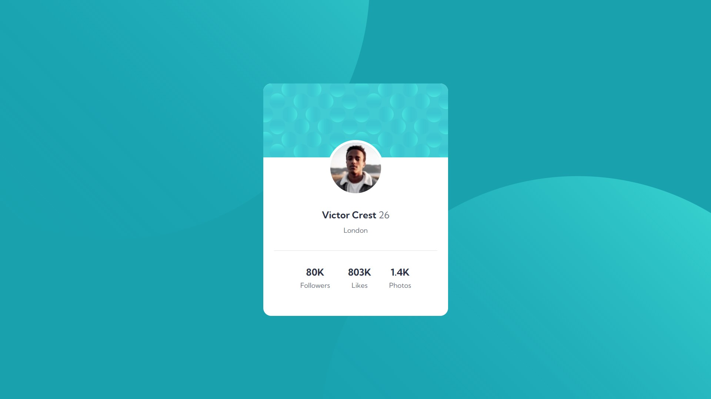
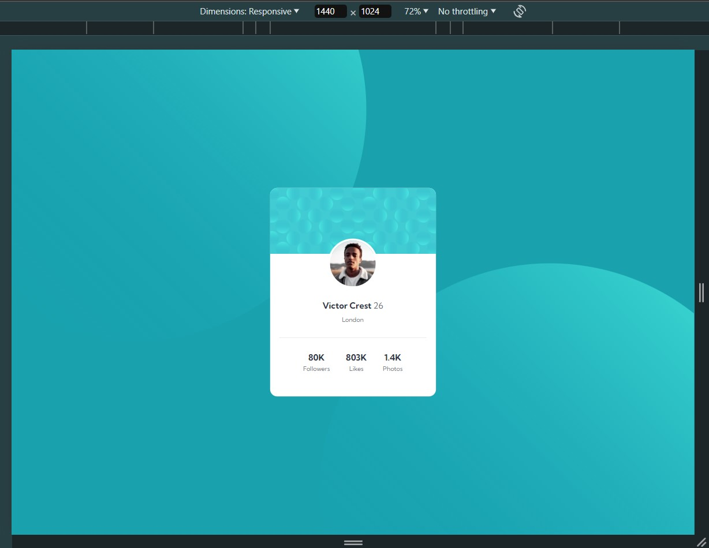
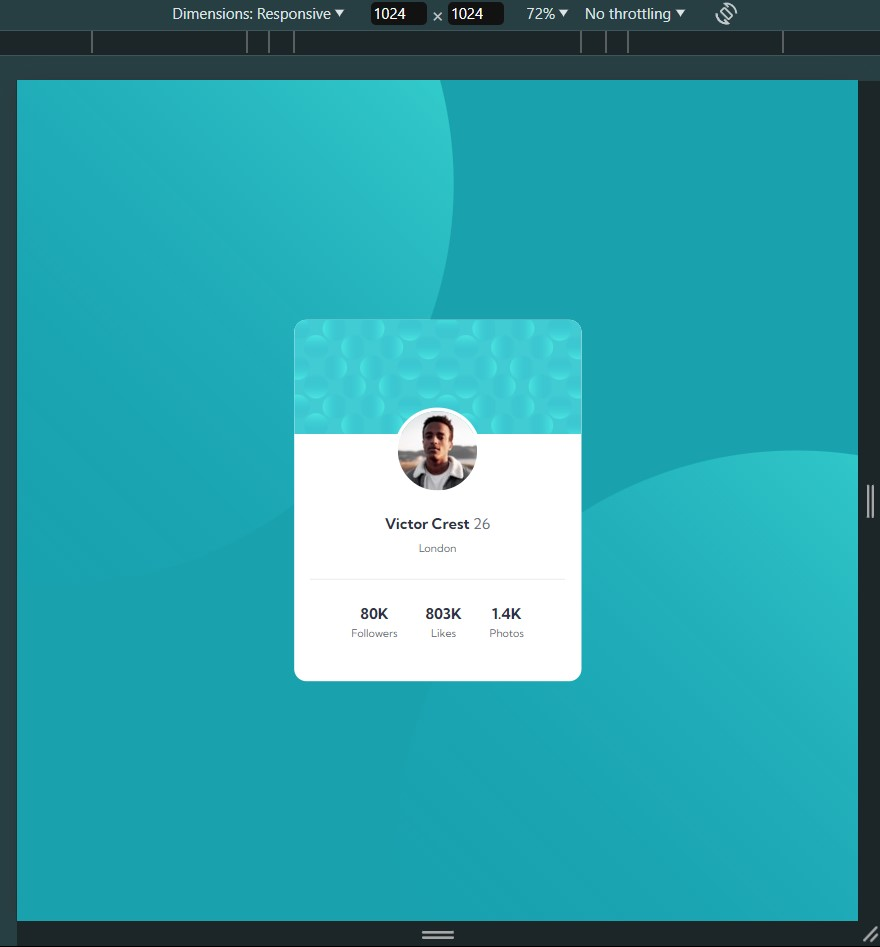
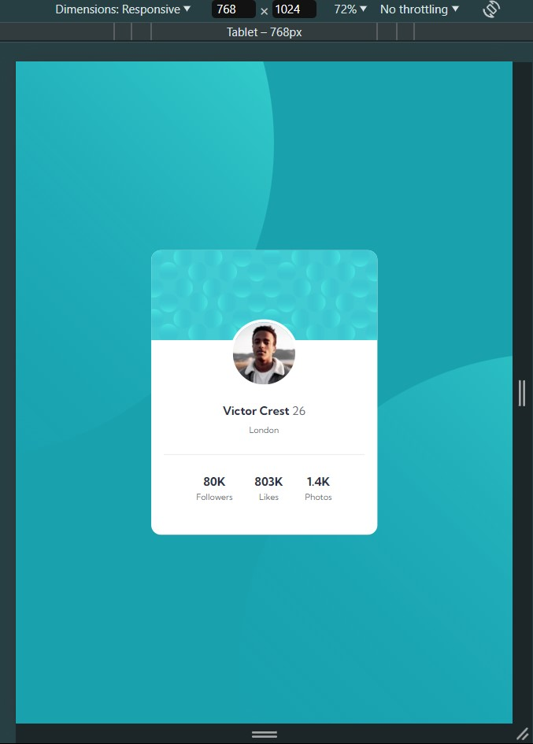
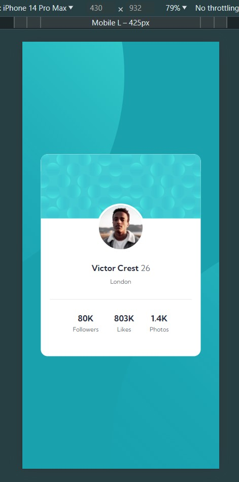
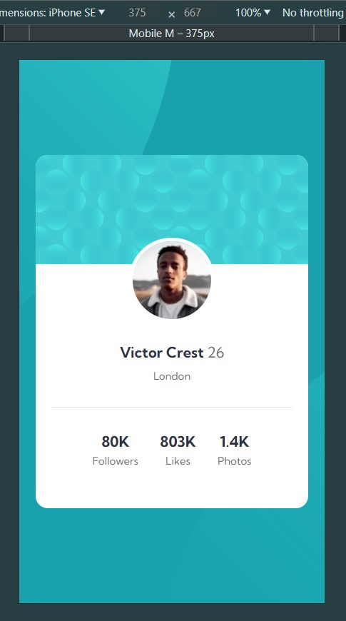

# Frontend Mentor - Profile card component

This is a solution to the [Profile card component coding challenge on Frontend Mentor](https://www.frontendmentor.io/challenges/profile-card-component-cfArpWshJ/hub).

Frontend Mentor challenges help improve skills by building realistic projects.

## Table of contents:

- [Overview](#overview)
  - [The challenge](#the-challenge)
  - [Screenshot](#screenshots)
  - [Links](#links)
- [My process](#my-process)
  - [Built with](#built-with)
  - [What I learned](#what-i-learned)
- [Author](#author)
- [Acknowledgments](#acknowledgments)
- [Personal Notes](#notes)

## Overview:

### The challenge:

Users should be able to:

- View the optimal layout depending on their device's screen size
- Get it looking as close to the design as possible.

 

Preview of initial design:

### Screenshots:

| Fullscreen View (Desktop)                             |
| ----------------------------------------------------- |
|  | 

| Animated Preview |
| ---------------------------------------------------------------------------------- |
|                                         |

 

**Note: This is a Mobile-First Approach & Wait for the GIF to load **

 

All viewports were included (except for the 4k view), in case the observer wishes to see the minor changes.

 

| Desktop View (1440px)                                | Laptop View (1024px)                                | Tablet View (768px)                                    |
| ---------------------------------------------------- | --------------------------------------------------- | ------------------------------------------------------ |
|  |  |  |

| Mobile L (430px)                                     | Mobile M (375px)                          |
| ----------------------------------------------------- | ---------------------------------------------------- |
|  | 

### Links:

- Live Site URL: [Website Link - Click Me](https://mark-siazon.github.io/FM-Profile-Card-Main-Component/)
- Solution URL: [FrontEndMentor - Click Me](https://www.frontendmentor.io/solutions/profile-card-main-component-fully-responsive-w-mobile-first-approach-MrtXzltw0O)

## My process:

### Built with:

- HTML5, CSS3
- Mobile-First Approach

### What I learned:

Recap over some of the major learnings while working through this project:

#### General things I've learned:

- Review of Semantic HTML & CSS, CSS Flex Layout
- Writing DRY code by combining similar styles
- Box Model & Responsive Design
- Implement BEM (Block Element Modifier) naming convention for classes, enhancing code readability and maintainability.

## Author:

- Github - [@Iron-Mark](https://github.com/Iron-Mark)
- Github - [@Mark-Siazon](https://github.com/Mark-Siazon)
- Frontend Mentor - [@Iron-Mark](https://www.frontendmentor.io/profile/Iron-Mark)
  - _(The Assets used in this project is originally from FrontendMentor)_

## Acknowledgments:

- I would like to acknowledge the hard work and dedication I put into this project while injured, yet I'm building this project with a right wrist sprain.
- I am grateful for my friends and those who motivate me to push through and not settle for relaxation.
- Also to tutorial i watched on youtube that helped me solve the background styling.
- I hope that this website serves its intended purpose. Thank you!

 

### Next Action (Soon):
- [ ] Add some Javascript Functionalities
- [ ] Create my own modified version of this project.
- [ ] TBA...

## Notes:

- I would be happy to receive comments, criticism, and such that could improve the website:
  - Cleaner Code
  - Better Practice/Approach to making this website.
- Feel free to approach and contact me :>
  - _Jul 2, 2024 (Initial Coding)_
  - _Jul 3, 2024 (Finalize Styles + Documentation)_
